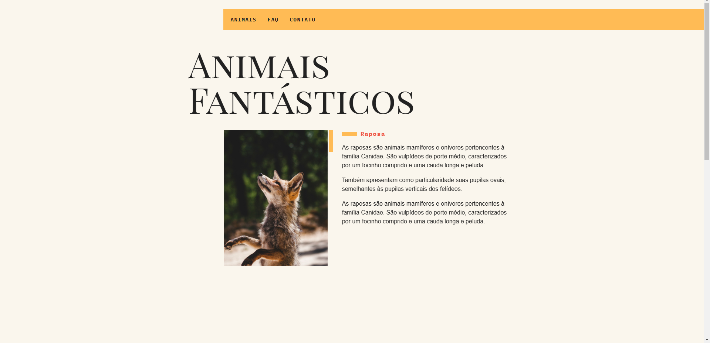
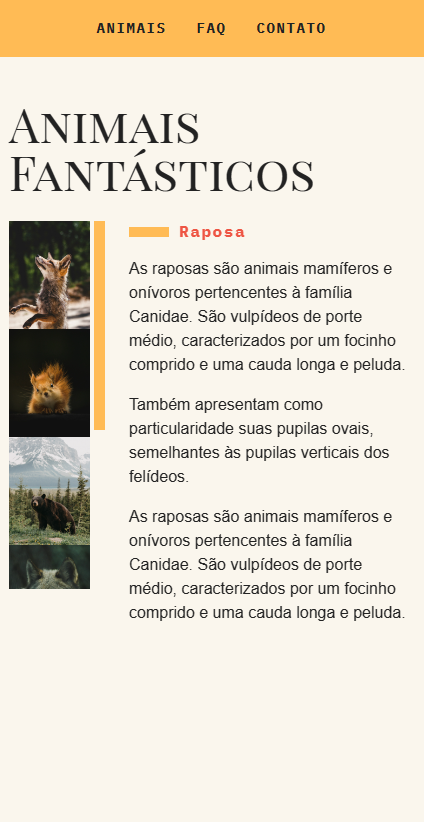

# Animais-Fantasticos

## Acesse o deploy do projeto: [Projeto](https://animais-fantasticos-victor.vercel.app/)

## Projeto desenvolvido com o curso de JavaScript da [Origamid](https://www.origamid.com/)

## Tecnologias utilizadas
- HTML, CSS e JavaScript

## Funcionalidades
- Trocar as informações dos animais ao clicar na imagem respectiva na lista de imagens (navegação por tabs)
- Scroll suave ao clicar nos links internos
- Mostrar resposta ao clicar na pergunta do FAQ (accordion list)
- Animação mostrando as sections ao scrollar pela página
- Modal de login
- Caixa com mais informações ou mover o mouse por cima do mapa em contato
- Menu dropdown ao apertar em 'sobre', que desaparece ao clicar fora dela
- Menu Mobile
- Animação de números crescendo (estilo timer)
- Indicador visual indicando se está ou não em horário de funcionamento

## Habilidades desenvolvidas
- Responsividade 
- Um pouco sobre transições e animações
- Conhecimentos de JavaScript
- Manipulação de DOM
- Acessibilidade em relação a JavaScript
- Eventos
- Accordion List
- Trabalhar com Módulos
- Modal
- ToolTipBox
- Utilizar Mutation Observer
- Trabalhar com Date

## Versão desktop

## Versão mobile

